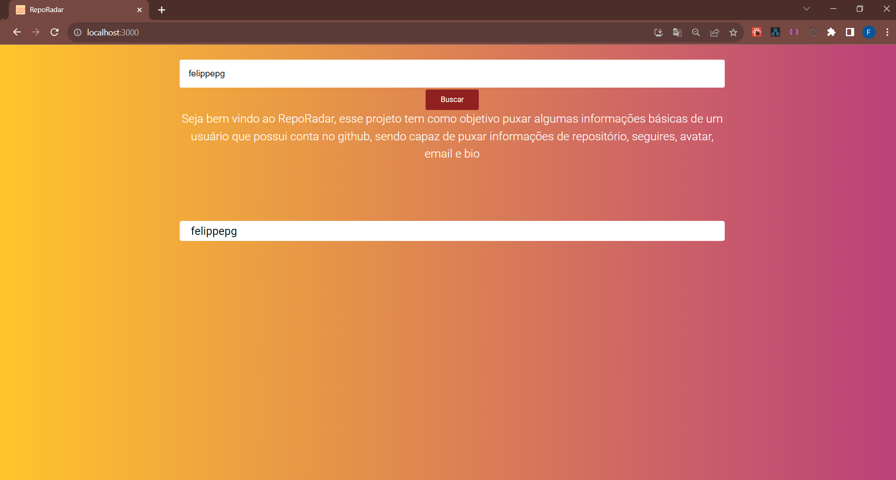
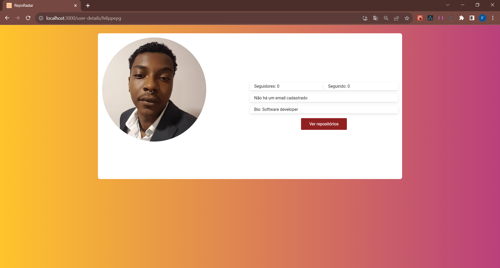
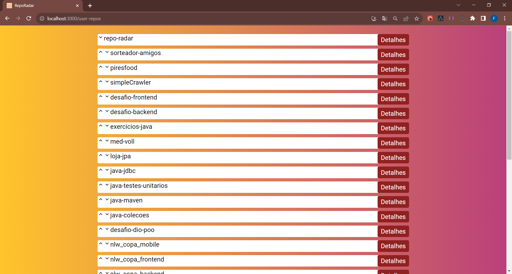
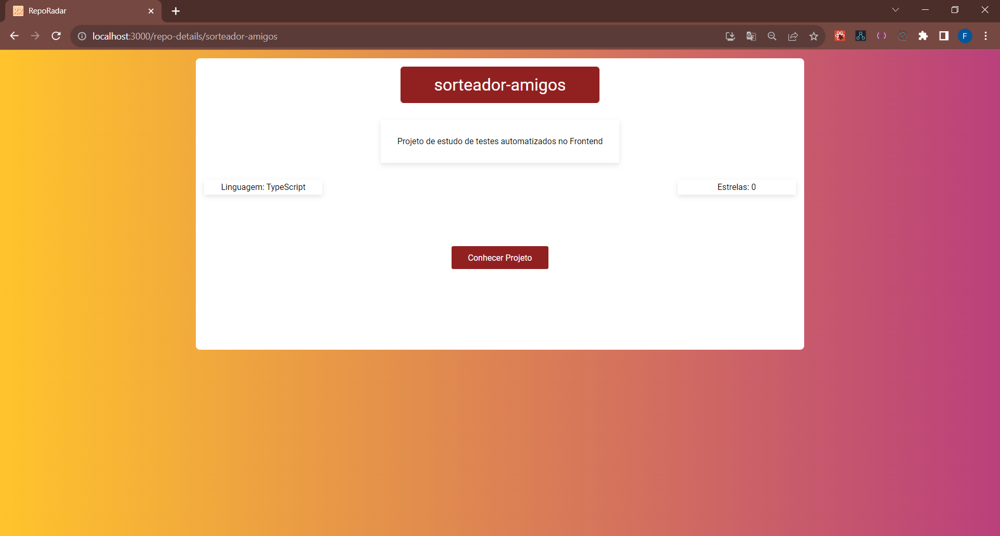

# RepoRadar


Bem-vindo ao projeto RepoRadar! Este projeto foi desenvolvido com o propósito de buscar informações de desenvolvedores do GitHub por meio da sua API oficial.

## Funcionalidades

- [x] Buscar por um usuário do GitHub.
- [x] Visualizar os detalhes do perfil do usuário buscado.
- [x] Alterar a ordem da lista de repositórios.
- [x] Ver uma página dedicada com os detalhes de um repositório.

### 🎲 Rodando o Projeto

```bash
$ git clone https://github.com/felippepg/repo-radar.git

# Acesse a pasta do projeto no terminal/cmd
$ cd repo-radar

# Instale todas as dependências necessárias para rodar o projeto
$ yarn OU npm install (dependendo do seu gerenciador de pacotes)

# Para iniciar o projeto em modo de desenvolvimento
$ yarn start OU npm run start

# Para rodar os testes automatizados
$ yarn test OU npm run test
```


Pagina home

<h1 align="center">
    
</h1>


Perfil

<h1 align="center">
    
</h1>


Lista

<h1 align="center">
    
</h1>


Repositorio

<h1 align="center">
    
</h1>

### 🛠 Tecnologias

As seguintes ferramentas foram usadas na construção da Pagina:

[React](https://react.dev/)
[Styled-Components](https://styled-components.com/)
[Jest](https://jestjs.io/pt-BR/)
[React Testing library](https://testing-library.com/)

Feito com ❤️ por [Felippe Pires] 👨‍💻
